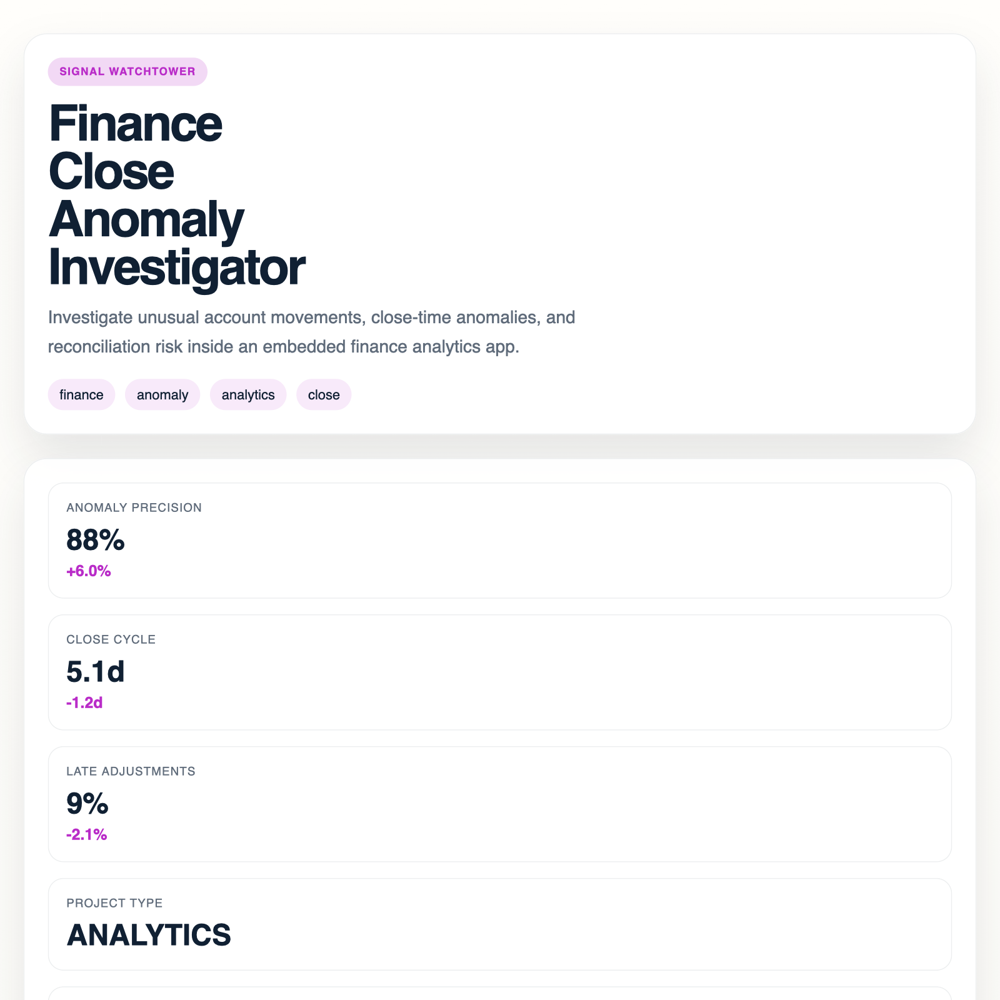

# Finance Close Anomaly Investigator



## Overview

Investigate unusual account movements, close-time anomalies, and reconciliation risk inside an embedded finance analytics app.

## Real-world problem

- User: Controllers and finance operations teams
- Problem: Month-end close issues often surface too late because account movements and reconciliation anomalies are scattered across tools.
- Decision improved: Find and explain unusual close movements before books are finalized.
- KPI target: Shorten close cycle time and reduce late manual adjustments.

## Why this matters

This repo is positioned as a real product for a real team, not a framework-only demo. The goal is to show how research-backed AI, analytics, or graph systems become deployable workflows with docs, UI, screenshots, and business-facing outputs.

## Project profile

- Domain: Finance Operations Analytics
- Project type: `analytics`
- Tags: finance, anomaly, analytics, close

## Workflow

1. Ingest the operational context for the user and case.
2. Score risk, quality, or opportunity using the project API.
3. Compare current signals against a business baseline.
4. Generate a recommendation or operator brief for the next step.

## Quick start

```bash
python -m venv .venv
source .venv/bin/activate
pip install -r requirements.txt
python scripts/bootstrap_data.py
uvicorn src.app.main:app --host 0.0.0.0 --port 8000 --reload
```

Open `http://localhost:8000/` to use the interactive application.

## Key endpoints

- `GET /`
- `GET /health`
- `GET /bootstrap`
- `GET /project`
- `POST /score`
- `POST /analyze`
- `POST /query`
- `POST /recommend`

## Documentation

- [Architecture](docs/architecture.md)
- [Evaluation](docs/evaluation.md)
- [Runbook](docs/runbook.md)
- [Innovation memo](research/innovation_memo.md)
- [Upstream audit](research/upstream_audit.md)
